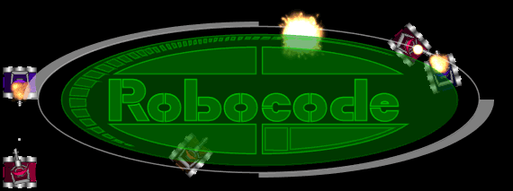
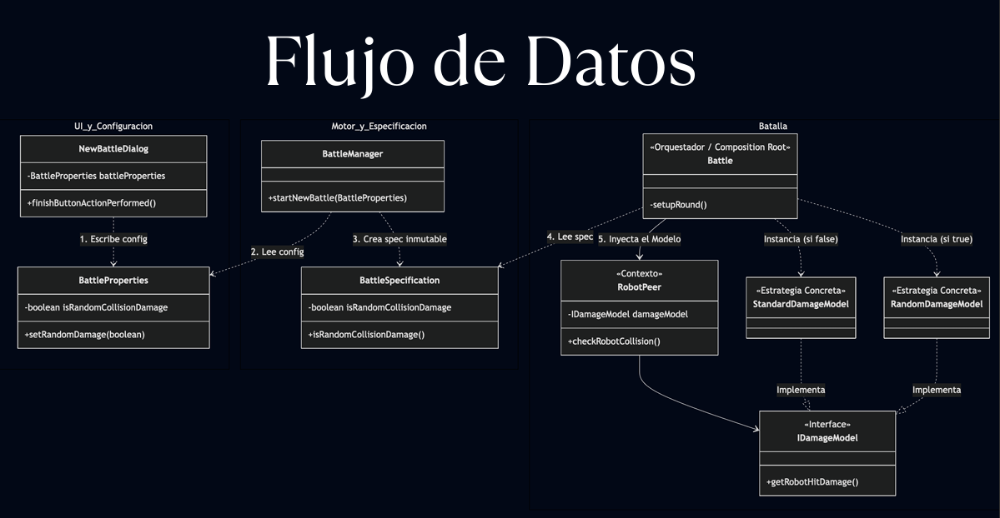
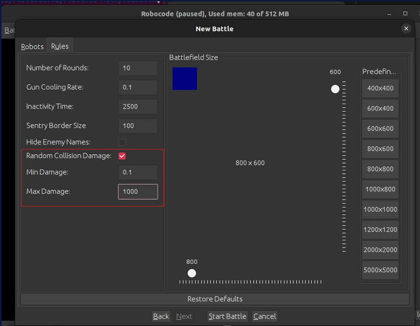

# Robocode feature - Random Collision Damage - Grupo 5



## 👥 Integrantes
* **Javier Arias**
* **Francisco Balbo**


## Enunciado
Randomizar el daño que los robots reciben al chocar entre sí.  
Se debe poder asignar al inicio de la batalla, de manera opcional.


Esta rama introduce la posibilidad de configurar un **rango de daño (mínimo y máximo)** para los proyectiles en Robocode, reemplazando o extendiendo el comportamiento estándar de daño fijo. 


## 🚀 Descripción de la Feature
El objetivo de esta funcionalidad es añadir un factor de variabilidad táctica a las batallas. En lugar de que cada colisión entre robots inflija un daño fijo predefinido en una constante en el código, el sistema permite definir un umbral de daño aleatorio que se calcula al momento de la colisión.

### Implementaciones clave:
* **Configuración desde la UI:** Nuevos campos de entrada en la pestaña de reglas de batalla.
* **Modelo Conmutable:** Capacidad de alternar entre el daño estándar y el aleatorio.
* **Validación de Rangos:** Control de lógica para asegurar que el daño mínimo no supere al máximo.

---

## 🏗️ Arquitectura y Diseño

Para mantener la extensibilidad y legibilidad del código (siguiendo las mejores prácticas de POO), se implementó el **Patrón Strategy** y se creó un punto de extensión que permite que además de elegir entre las 2 variables diposibles (daño default y aleatorio), ahora desarrolladores puedan extender la interfaz a añadir un comportamiento propio para el calculo de este daño, siendo esto completamente retrocompatible con el código, robots y reglas existentes.

### Diagrama de Flujo de Datos
El siguiente diagrama detalla cómo los parámetros ingresados en la interfaz de usuario viajan a través del núcleo de Robocode hasta impactar en el cálculo de salud de los robots:


> *Figura 1: Diagrama de secuencia y flujo de datos desde la UI hacia el DamageModel.*

### Componentes Principales:
* **`IDamageModel` (Interface):** Define el contrato para el cálculo de daño.
* **`StandardDamageModel`:** Implementación por defecto que mantiene la lógica original de Robocode.
* **`RandomDamageModel`:** Nueva estrategia que utiliza la clase `java.util.Random` para determinar el daño final basado en los límites configurados.
* **`NewBattleRulesTab`:** Modificación de la UI para capturar los valores `minDamage` y `maxDamage`.

---

## 🖥️ Interfaz de Usuario (UI)

Se han añadido controles específicos en el menú de configuración de la batalla para facilitar la personalización de la feature sin necesidad de modificar archivos de propiedades manualmente.


> *Figura 2: Vista de los nuevos campos de configuración en la pestaña "Rules".*

---

## 🛠️ Setup y Ejecución

### Requisitos previos
* JDK 8 o superior.
* Gradle (incluido mediante el wrapper).

### Setup (Unix/Linux/Mac):
```bash
-- UNIX --
./gradlew build
cd .sandbox
./robocode.sh
Setup (Windows):

-------------------------------------------------

--WINDOWS--
.\gradlew.bat build
cd .sandbox
.\robocode.bat

💡 Solución de problemas en Windows:
Si la compilación falla por procesos bloqueados o conflictos de caché:
1)Cerrar todos los IDEs (IntelliJ, Eclipse, VS Code).
2)Abrir PowerShell como Administrador.
3)Ejecutar los siguientes comandos:

.\gradlew.bat --stop
Get-ChildItem -Path . -Recurse -Directory -Filter "build" | Remove-Item -Recurse -Force
Reintentar el proceso de Setup normal.  (los paso mencinados anteriormente)
```

## 🧪 Pruebas Realizadas
**Tests de unidad:** Validación de las fórmulas matemáticas en RandomDamageModel.

**Tests de integración:** Verificación de la persistencia de los valores desde la UI hacia el objeto BattleProperties.

**Testeo manual:** Ejecución de batallas de prueba observando la variabilidad de la energía de los robots tras recibir impactos.


---

