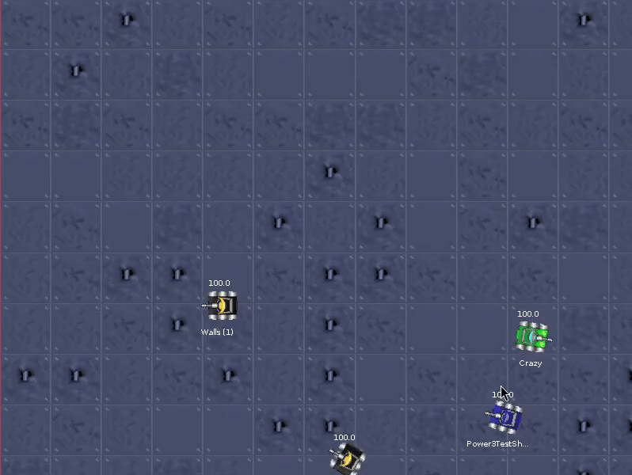
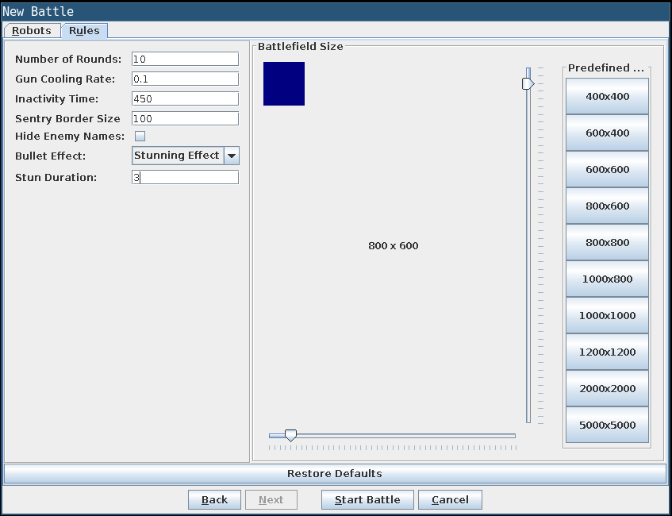
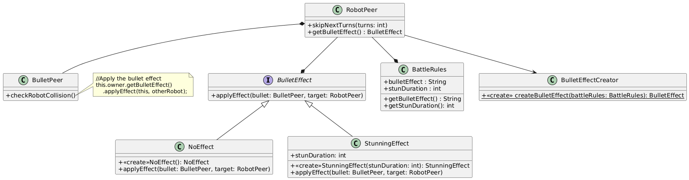

# Robocode: Stunning Bullets

**Robocode: Stunning Bullets** is an extension of the [robocode programming game](https://github.com/roo2-unlp/robocode) that allows the use of special ammunition in your battles. These new projectiles lock their targets on impact, opening the door for lots of new strategies and tactics!

## Preview

## Details
The extension allows to create a new battle that uses `Stunning Bullets`. When a robot is hit by one of these bullets it will be stunned by a variable number of turns. The number of turns is proportional to the energy spent to fire the bullet and the `Stun Duration` parameter set in the `Rules` tab.

When a robot is stunned it cannot move nor fire. If a robot is hit while being stunned the new stun duration will be the maximum between the current remaining stunned turns and the stun duration of this new bullet impact.

## Usage
To use stunning bullets simply start a new battle, and select `Stunning Effect` in the rules tab. Additionally you can change the default `Stun Duration`.

## How It Works
- When a new battle is created, the `BattleRules` class stores the selected bullet effect (as a string) and the configured `Stun Duration`.

- When each `RobotPeer` is constructed, the `BulletEffectCreator` is used to create the appropriate `BulletEffect` instance based on the values in `BattleRules`, and this instance is stored inside the robot.

- In the `BulletPeer` method `checkRobotCollision`, when a bullet hits a robot, the bullet notifies the corresponding `BulletEffect` (held by the shooting robot’s `RobotPeer`), which then applies the effect to the target robot.

## Resources
- [Robocode home page]
- [Introduction] to Robocode
- [RoboWiki] is the best way to learn about Robocoding
- [Robocode group] is where you can ask questions
- [Facebook group] is a community for enthusiasts of the Robocode programming game
- [Robocode Application Developers] is for people that want to develop or experiments with the Robocode application (
  game)
- [Robocode Guide for building Robocode], if you want to build Robocode yourself

- [Robocode Tank Royale] is a new platform for Robocode

[programming game]: https://x-team.com/magazine/coding-games "23 Programming Games to Level Up Your Programming Skills"

[Robocode home page]: https://robocode.sourceforge.io/ "Home page for Robocode"

[Introduction]: https://robocode.sourceforge.io/docs/ReadMe.html "Introduction into Robocode"

[RoboWiki]: https://robowiki.net/ "RoboWiki - Collecting Robocode knowledge since 2003"

[Robocode group]: https://groups.google.com/g/robocode "The Robocode Group"

[Facebook group]: https://www.facebook.com/groups/129627130234/ "The Facebook group for Robocode"

[Robocode Guide for building Robocode]: https://robowiki.net/wiki/Robocode/Developers_Guide_for_building_Robocode "The guide for how to how to build Robocode (the game)"

[Robocode Application Developers]: https://groups.google.com/g/robocode-developers "Group for developers of the Robocode application"

[Robocode Tank Royale]: https://github.com/robocode-dev/tank-royale/blob/main/README.md "Robocode Tank Royale"
